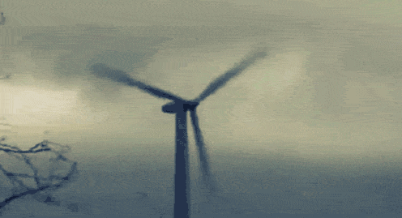

<html>
<body>
<h1>
  WIND BABY
</h1>
  
This is showing the total Windmills built per state for each year
 
 
  
A bar graph of installed wind capacity by state.

 
  
The same data as a map, with a special color given to states with no notable wind power.

 
  
A graph of the results of our third view-creating SELECT query.

  
  
This Chart Shows Which States Produce the Most Wind Energy

 
  
  
</body>
</html>
